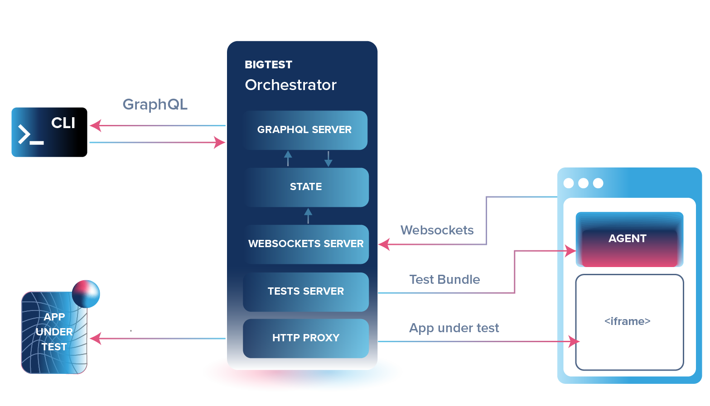

## Distributed Agents

Selenium's power and flexibility lies in the fact that it assumes nothing about the application nor where or how it is running. Selenium performs one HTTP request to the target browser for every interaction and assertion in the test script. It can therefore count with an agent on every browser that understands HTTP requests. In Selenium agents are also relatively easy to implement because they're dummy: they only follow the instructions provided to them by the server.  However, relying on HTTP requests for every single operation makes Selenium slow and prone to flakiness.

Cypress is more reliable and faster because it runs the tests within the browser. Thus it has no HTTP round-trips and instead relies on direct process communication, which is almost fault-proof. Cypress spins up a node server that has a direct control of the browser where the tests run. But it is limited in that you can only use Cypress with browsers that the node process can control – namely electron Chrome and electron Firefox.

BigTest takes the best of both Selenium and Cypress by implementing a smarter agent for the browser. BigTest first sends the entire test suite to the agent running in a real browser over HTTP. Because the agent is not dummy, it understands the test suite, runs it within the browser context and interprets the results, which it communicates to the BigTest server over websockets in real time.

## GraphQL as data protocol

As a unified testing platform, BigTest has access to all the information about a test – before, during, and after it runs. There are no inaccessible information silos, opening up countless possibilities for optimizing tests, creating tools, and generating analytics.

BigTest’s information is made available through a GraphQL server that allows you to receive updates in real time. You can not only read information from BigTest but also issue mutations to make BigTest run tests programmatically. For instance, BigTest's CLI is simple because it is nothing more than a GraphQL client.

